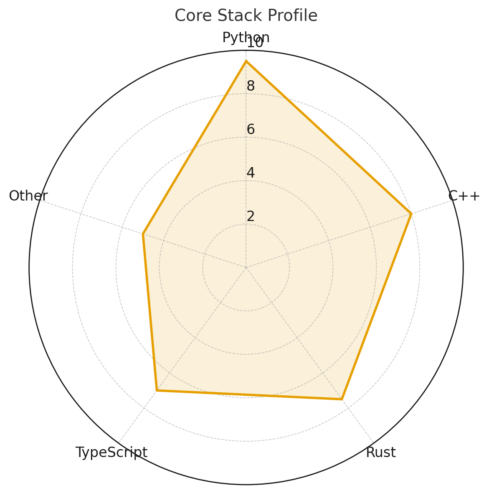

### Hi there 👋 🚀 🧑‍💻 🤖  

- 🔭 I’m currently working on **quantitative finance systems, distributed systems, and research in stochastic control, numerical methods, and adsorption modeling**.  
- 🌱 I’m currently learning **advanced software architecture (Spring Boot, microservices, UML design), functional analysis, and cutting-edge DevOps tooling (Kubernetes, Terraform, cloud infrastructure)**.  
- 👯 I’m looking to collaborate on **open-source projects in algorithmic trading, applied mathematics, scientific computing, and full-stack SaaS applications**.  
- 🤔 I’m looking for help with **refining large-scale stochastic models, building efficient multi-threaded systems in Rust/C, and advanced ML for financial applications**.  
- 💬 Ask me about **quant research, ETF trading strategies, distributed systems, LaTeX workflows, or bridging pure math with real-world systems**.  
- 📫 How to reach me: [](https://discord.com/users/quasi_monte) [](https://www.linkedin.com/in/apapaio/) [](https://facetime.apple.com/join#v=1&p=4grXTV3PEfCori6h2oN83w&k=CB6xz_PbCjoKe6yIOj_E1uULj45S_NYT0jLPSsmmNbo)
- 👨/🧑‍💻/🌈 ally 
- ⚡ Fun fact: I’ve built everything from **quant trading engines and distributed systems** to **Pokémon battle simulators**, and I love finding connections between **serious research** and **playful side projects**.  


<!--  -->


 <a href='https://ko-fi.com/U6U31KF346' target='_blank'></a>
<!--START_SECTION:waka-->


**🐱 My GitHub Data** 

> 📦 194.8 kB Used in GitHub's Storage 
 > 
> 💼 Opted to Hire
 > 
> 📜 78 Public Repositories 
 > 
> 🔑 23 Private Repositories 
 > 
**I'm a Night 🦉** 

```text
🌞 Morning                299 commits         ⬛⬛⬜⬜⬜⬜⬜⬜⬜⬜⬜⬜⬜⬜⬜⬜⬜⬜⬜⬜⬜⬜⬜⬜⬜   07.22 % 
🌆 Daytime                1632 commits        ⬛⬛⬛⬛⬛⬛⬛⬛⬛⬛⬜⬜⬜⬜⬜⬜⬜⬜⬜⬜⬜⬜⬜⬜⬜   39.42 % 
🌃 Evening                1700 commits        ⬛⬛⬛⬛⬛⬛⬛⬛⬛⬛⬜⬜⬜⬜⬜⬜⬜⬜⬜⬜⬜⬜⬜⬜⬜   41.06 % 
🌙 Night                  509 commits         ⬛⬛⬛⬜⬜⬜⬜⬜⬜⬜⬜⬜⬜⬜⬜⬜⬜⬜⬜⬜⬜⬜⬜⬜⬜   12.29 % 
```
📅 **I'm Most Productive on Tuesday** 

```text
Monday                   771 commits         ⬛⬛⬛⬛⬛⬜⬜⬜⬜⬜⬜⬜⬜⬜⬜⬜⬜⬜⬜⬜⬜⬜⬜⬜⬜   18.62 % 
Tuesday                  1056 commits        ⬛⬛⬛⬛⬛⬛⬜⬜⬜⬜⬜⬜⬜⬜⬜⬜⬜⬜⬜⬜⬜⬜⬜⬜⬜   25.51 % 
Wednesday                742 commits         ⬛⬛⬛⬛⬜⬜⬜⬜⬜⬜⬜⬜⬜⬜⬜⬜⬜⬜⬜⬜⬜⬜⬜⬜⬜   17.92 % 
Thursday                 208 commits         ⬛⬜⬜⬜⬜⬜⬜⬜⬜⬜⬜⬜⬜⬜⬜⬜⬜⬜⬜⬜⬜⬜⬜⬜⬜   05.02 % 
Friday                   214 commits         ⬛⬜⬜⬜⬜⬜⬜⬜⬜⬜⬜⬜⬜⬜⬜⬜⬜⬜⬜⬜⬜⬜⬜⬜⬜   05.17 % 
Saturday                 451 commits         ⬛⬛⬛⬜⬜⬜⬜⬜⬜⬜⬜⬜⬜⬜⬜⬜⬜⬜⬜⬜⬜⬜⬜⬜⬜   10.89 % 
Sunday                   698 commits         ⬛⬛⬛⬛⬜⬜⬜⬜⬜⬜⬜⬜⬜⬜⬜⬜⬜⬜⬜⬜⬜⬜⬜⬜⬜   16.86 % 
```


📊 **This Week I Spent My Time On** 

```text
🕑︎ Time Zone: America/New_York

💬 Programming Languages: 
Java                     37 mins             ⬛⬛⬛⬛⬛⬛⬛⬜⬜⬜⬜⬜⬜⬜⬜⬜⬜⬜⬜⬜⬜⬜⬜⬜⬜   29.84 % 
XML                      23 mins             ⬛⬛⬛⬛⬛⬜⬜⬜⬜⬜⬜⬜⬜⬜⬜⬜⬜⬜⬜⬜⬜⬜⬜⬜⬜   18.40 % 
Makefile                 18 mins             ⬛⬛⬛⬛⬜⬜⬜⬜⬜⬜⬜⬜⬜⬜⬜⬜⬜⬜⬜⬜⬜⬜⬜⬜⬜   14.56 % 
YAML                     17 mins             ⬛⬛⬛⬜⬜⬜⬜⬜⬜⬜⬜⬜⬜⬜⬜⬜⬜⬜⬜⬜⬜⬜⬜⬜⬜   13.62 % 
Java Properties          15 mins             ⬛⬛⬛⬜⬜⬜⬜⬜⬜⬜⬜⬜⬜⬜⬜⬜⬜⬜⬜⬜⬜⬜⬜⬜⬜   11.84 % 

🔥 Editors: 
IntelliJ IDEA            1 hr 44 mins        ⬛⬛⬛⬛⬛⬛⬛⬛⬛⬛⬛⬛⬛⬛⬛⬛⬛⬛⬛⬛⬛⬜⬜⬜⬜   82.06 % 
Sublime Text             20 mins             ⬛⬛⬛⬛⬜⬜⬜⬜⬜⬜⬜⬜⬜⬜⬜⬜⬜⬜⬜⬜⬜⬜⬜⬜⬜   16.27 % 
RustRover                2 mins              ⬜⬜⬜⬜⬜⬜⬜⬜⬜⬜⬜⬜⬜⬜⬜⬜⬜⬜⬜⬜⬜⬜⬜⬜⬜   01.68 % 

🐱‍💻 Projects: 
ap                       2 hrs 6 mins        ⬛⬛⬛⬛⬛⬛⬛⬛⬛⬛⬛⬛⬛⬛⬛⬛⬛⬛⬛⬛⬛⬛⬛⬛⬛   100.00 % 

💻 Operating System: 
Mac                      2 hrs 6 mins        ⬛⬛⬛⬛⬛⬛⬛⬛⬛⬛⬛⬛⬛⬛⬛⬛⬛⬛⬛⬛⬛⬛⬛⬛⬛   100.00 % 
```

**I Mostly Code in Jupyter Notebook** 

```text
Python                   6 repos             ⬛⬛⬛⬛⬛⬜⬜⬜⬜⬜⬜⬜⬜⬜⬜⬜⬜⬜⬜⬜⬜⬜⬜⬜⬜   20.69 % 
TypeScript               3 repos             ⬛⬛⬛⬜⬜⬜⬜⬜⬜⬜⬜⬜⬜⬜⬜⬜⬜⬜⬜⬜⬜⬜⬜⬜⬜   10.34 % 
C                        2 repos             ⬛⬛⬜⬜⬜⬜⬜⬜⬜⬜⬜⬜⬜⬜⬜⬜⬜⬜⬜⬜⬜⬜⬜⬜⬜   06.90 % 
JavaScript               2 repos             ⬛⬛⬜⬜⬜⬜⬜⬜⬜⬜⬜⬜⬜⬜⬜⬜⬜⬜⬜⬜⬜⬜⬜⬜⬜   06.90 % 
TeX                      1 repo              ⬛⬜⬜⬜⬜⬜⬜⬜⬜⬜⬜⬜⬜⬜⬜⬜⬜⬜⬜⬜⬜⬜⬜⬜⬜   03.45 % 
```


**Timeline**


 Last Updated on 02/11/2025 02:37:25 UTC
<!--END_SECTION:waka-->

<p align="center">
  <!-- GitHub Stats -->
  <a href="https://github-readme-stats.vercel.app/api?username=alex-papaioannou&show_icons=true&theme=transparent">
    
  </a>

  <!-- Profile Summary Card -->
  <a href="https://github-profile-summary-cards.vercel.app/api/cards/profile-details?username=alex-papaioannou&theme=github">
    
  </a>

  <!-- Tech Radar (scaled down) -->
  <a href="assets/tech_radar.png">
    
  </a>
</p>

<!-- Bottom row: Languages -->
<p align="center">
  <!-- Most Commit Language -->
  <a href="http://github-profile-summary-cards.vercel.app/api/cards/most-commit-language?username=alex-papaioannou&theme=default">
    
  </a>

  <!-- Repos per Language -->
  <a href="http://github-profile-summary-cards.vercel.app/api/cards/repos-per-language?username=alex-papaioannou&theme=default">
    
  </a>
</p>

### ⚡ Toolbelt
<p float="left">
  <!-- Languages -->
  
  
  
  
  
  
  
  
  
  
  
  
  
  
  
  
  
  
  
  
  
  
  
  
  

  <!-- DevOps / Cloud -->
  
  
  
  
  
  

  <!-- Version Control -->
  
  
</p>

## 📚 Learning
<p float="left">
    
  
    
  
  
</p>
</p>
