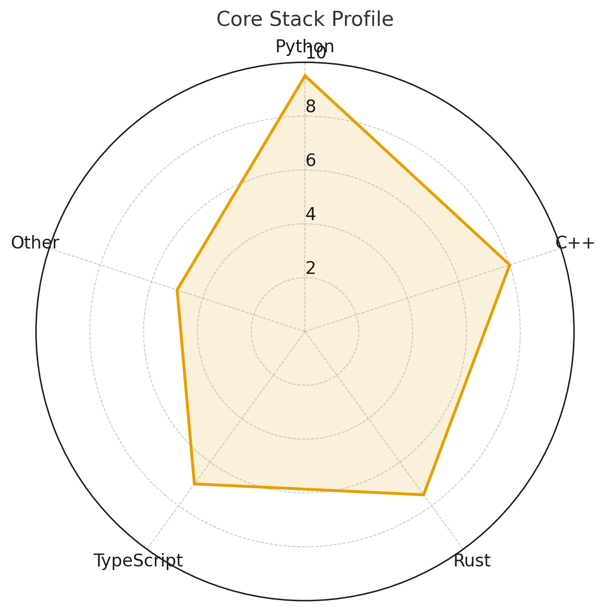

### Hi there 👋 🚀 🧑‍💻 🤖  

- 🔭 I’m currently working on **quantitative finance systems, distributed systems, and research in stochastic control, numerical methods, and adsorption modeling**.  
- 🌱 I’m currently learning **advanced software architecture (Spring Boot, microservices, UML design), functional analysis, and cutting-edge DevOps tooling (Kubernetes, Terraform, cloud infrastructure)**.  
- 👯 I’m looking to collaborate on **open-source projects in algorithmic trading, applied mathematics, scientific computing, and full-stack SaaS applications**.  
- 🤔 I’m looking for help with **refining large-scale stochastic models, building efficient multi-threaded systems in Rust/C, and advanced ML for financial applications**.  
- 💬 Ask me about **quant research, ETF trading strategies, distributed systems, LaTeX workflows, or bridging pure math with real-world systems**.  
- 📫 How to reach me: [](https://discord.com/users/quasi_monte) [](https://www.linkedin.com/in/apapaio/) [](https://facetime.apple.com/join#v=1&p=4grXTV3PEfCori6h2oN83w&k=CB6xz_PbCjoKe6yIOj_E1uULj45S_NYT0jLPSsmmNbo)
- 👨/🧑‍💻/🌈 ally 
- ⚡ Fun fact: I’ve built everything from **quant trading engines and distributed systems** to **Pokémon battle simulators**, and I love finding connections between **serious research** and **playful side projects**.  


<!--  -->


 <a href='https://ko-fi.com/U6U31KF346' target='_blank'></a>


<!--START_SECTION:waka-->


<!--   -->


**🐱 My GitHub Data** 

> 📦 313.5 kB Used in GitHub's Storage 
 > 
> 🏆 0 Contributions in the Year 2026
 > 
> 💼 Opted to Hire
 > 
> 📜 78 Public Repositories 
 > 
> 🔑 25 Private Repositories 
 > 
**I'm a Night 🦉** 

```text
🌞 Morning                477 commits         ⬛⬛⬜⬜⬜⬜⬜⬜⬜⬜⬜⬜⬜⬜⬜⬜⬜⬜⬜⬜⬜⬜⬜⬜⬜   09.27 % 
🌆 Daytime                1939 commits        ⬛⬛⬛⬛⬛⬛⬛⬛⬛⬜⬜⬜⬜⬜⬜⬜⬜⬜⬜⬜⬜⬜⬜⬜⬜   37.69 % 
🌃 Evening                2172 commits        ⬛⬛⬛⬛⬛⬛⬛⬛⬛⬛⬛⬜⬜⬜⬜⬜⬜⬜⬜⬜⬜⬜⬜⬜⬜   42.22 % 
🌙 Night                  556 commits         ⬛⬛⬛⬜⬜⬜⬜⬜⬜⬜⬜⬜⬜⬜⬜⬜⬜⬜⬜⬜⬜⬜⬜⬜⬜   10.81 % 
```
📅 **I'm Most Productive on Wednesday** 

```text
Monday                   890 commits         ⬛⬛⬛⬛⬜⬜⬜⬜⬜⬜⬜⬜⬜⬜⬜⬜⬜⬜⬜⬜⬜⬜⬜⬜⬜   17.30 % 
Tuesday                  1121 commits        ⬛⬛⬛⬛⬛⬜⬜⬜⬜⬜⬜⬜⬜⬜⬜⬜⬜⬜⬜⬜⬜⬜⬜⬜⬜   21.79 % 
Wednesday                1146 commits        ⬛⬛⬛⬛⬛⬛⬜⬜⬜⬜⬜⬜⬜⬜⬜⬜⬜⬜⬜⬜⬜⬜⬜⬜⬜   22.28 % 
Thursday                 381 commits         ⬛⬛⬜⬜⬜⬜⬜⬜⬜⬜⬜⬜⬜⬜⬜⬜⬜⬜⬜⬜⬜⬜⬜⬜⬜   07.41 % 
Friday                   285 commits         ⬛⬜⬜⬜⬜⬜⬜⬜⬜⬜⬜⬜⬜⬜⬜⬜⬜⬜⬜⬜⬜⬜⬜⬜⬜   05.54 % 
Saturday                 609 commits         ⬛⬛⬛⬜⬜⬜⬜⬜⬜⬜⬜⬜⬜⬜⬜⬜⬜⬜⬜⬜⬜⬜⬜⬜⬜   11.84 % 
Sunday                   712 commits         ⬛⬛⬛⬜⬜⬜⬜⬜⬜⬜⬜⬜⬜⬜⬜⬜⬜⬜⬜⬜⬜⬜⬜⬜⬜   13.84 % 
```


📊 **This Week I Spent My Time On** 

```text
🕑︎ Time Zone: America/New_York

💬 Programming Languages: 
Java                     6 hrs 59 mins       ⬛⬛⬛⬛⬛⬛⬛⬛⬛⬛⬛⬛⬜⬜⬜⬜⬜⬜⬜⬜⬜⬜⬜⬜⬜   47.37 % 
Other                    2 hrs 52 mins       ⬛⬛⬛⬛⬛⬜⬜⬜⬜⬜⬜⬜⬜⬜⬜⬜⬜⬜⬜⬜⬜⬜⬜⬜⬜   19.43 % 
Markdown                 1 hr 48 mins        ⬛⬛⬛⬜⬜⬜⬜⬜⬜⬜⬜⬜⬜⬜⬜⬜⬜⬜⬜⬜⬜⬜⬜⬜⬜   12.24 % 
TypeScript               1 hr 34 mins        ⬛⬛⬛⬜⬜⬜⬜⬜⬜⬜⬜⬜⬜⬜⬜⬜⬜⬜⬜⬜⬜⬜⬜⬜⬜   10.71 % 
XML                      31 mins             ⬛⬜⬜⬜⬜⬜⬜⬜⬜⬜⬜⬜⬜⬜⬜⬜⬜⬜⬜⬜⬜⬜⬜⬜⬜   03.54 % 

🔥 Editors: 
IntelliJ IDEA            7 hrs 39 mins       ⬛⬛⬛⬛⬛⬛⬛⬛⬛⬛⬛⬛⬛⬜⬜⬜⬜⬜⬜⬜⬜⬜⬜⬜⬜   51.83 % 
VS Code                  6 hrs 58 mins       ⬛⬛⬛⬛⬛⬛⬛⬛⬛⬛⬛⬛⬜⬜⬜⬜⬜⬜⬜⬜⬜⬜⬜⬜⬜   47.25 % 
Sublime Text             8 mins              ⬜⬜⬜⬜⬜⬜⬜⬜⬜⬜⬜⬜⬜⬜⬜⬜⬜⬜⬜⬜⬜⬜⬜⬜⬜   00.92 % 

🐱‍💻 Projects: 
hw1                      7 hrs 39 mins       ⬛⬛⬛⬛⬛⬛⬛⬛⬛⬛⬛⬛⬛⬜⬜⬜⬜⬜⬜⬜⬜⬜⬜⬜⬜   51.83 % 
courseradar.io           5 hrs 46 mins       ⬛⬛⬛⬛⬛⬛⬛⬛⬛⬛⬜⬜⬜⬜⬜⬜⬜⬜⬜⬜⬜⬜⬜⬜⬜   39.13 % 
reviews                  1 hr 11 mins        ⬛⬛⬜⬜⬜⬜⬜⬜⬜⬜⬜⬜⬜⬜⬜⬜⬜⬜⬜⬜⬜⬜⬜⬜⬜   08.12 % 
ap                       8 mins              ⬜⬜⬜⬜⬜⬜⬜⬜⬜⬜⬜⬜⬜⬜⬜⬜⬜⬜⬜⬜⬜⬜⬜⬜⬜   00.92 % 

💻 Operating System: 
Mac                      14 hrs 45 mins      ⬛⬛⬛⬛⬛⬛⬛⬛⬛⬛⬛⬛⬛⬛⬛⬛⬛⬛⬛⬛⬛⬛⬛⬛⬛   100.00 % 
```

**I Mostly Code in Jupyter Notebook** 

```text
TypeScript               6 repos             ⬛⬛⬛⬛⬛⬜⬜⬜⬜⬜⬜⬜⬜⬜⬜⬜⬜⬜⬜⬜⬜⬜⬜⬜⬜   18.18 % 
Python                   6 repos             ⬛⬛⬛⬛⬛⬜⬜⬜⬜⬜⬜⬜⬜⬜⬜⬜⬜⬜⬜⬜⬜⬜⬜⬜⬜   18.18 % 
Java                     3 repos             ⬛⬛⬜⬜⬜⬜⬜⬜⬜⬜⬜⬜⬜⬜⬜⬜⬜⬜⬜⬜⬜⬜⬜⬜⬜   09.09 % 
C                        2 repos             ⬛⬛⬜⬜⬜⬜⬜⬜⬜⬜⬜⬜⬜⬜⬜⬜⬜⬜⬜⬜⬜⬜⬜⬜⬜   06.06 % 
TeX                      1 repo              ⬛⬜⬜⬜⬜⬜⬜⬜⬜⬜⬜⬜⬜⬜⬜⬜⬜⬜⬜⬜⬜⬜⬜⬜⬜   03.03 % 
```


**Timeline**


 Last Updated on 08/01/2026 01:36:13 UTC
<!--END_SECTION:waka-->

<p align="center">
  <!-- GitHub Stats -->
  <a href="https://github-readme-stats.vercel.app/api?username=alex-papaioannou&show_icons=true&theme=transparent">
    
  </a>

  <!-- Profile Summary Card -->
  <a href="https://github-profile-summary-cards.vercel.app/api/cards/profile-details?username=alex-papaioannou&theme=github">
    
  </a>

  <!-- Tech Radar (scaled down) -->
  <a href="assets/tech_radar.png">
    
  </a>
</p>

<!-- Bottom row: Languages -->
<p align="center">
  <!-- Most Commit Language -->
  <a href="http://github-profile-summary-cards.vercel.app/api/cards/most-commit-language?username=alex-papaioannou&theme=default">
    
  </a>

  <!-- Repos per Language -->
  <a href="http://github-profile-summary-cards.vercel.app/api/cards/repos-per-language?username=alex-papaioannou&theme=default">
    
  </a>
</p>

### ⚡ Toolbelt
<p float="left">
  <!-- Languages -->
  
  
  
  
  
  
  
  
  
  
  
  
  
  
  
  
  
  
  
  
  
  
  
  
  

  <!-- DevOps / Cloud -->
  
  
  
  
  
  

  <!-- Version Control -->
  
  


[](https://spring.io/)
[](https://spring.io/projects/spring-boot)
[](https://nodejs.org/en)

[](https://redis.io/)
[](https://www.mysql.com/)
[](https://www.mongodb.com/)
[](https://neo4j.com/)

[](https://kubernetes.io/)
[](https://www.docker.com/)

[](https://github.com/features/actions)
[](https://about.gitlab.com/)

[](https://react.dev/)


[](https://www.java.com)
[](https://www.javascript.com/)
[](https://www.python.org/)
[](https://cplusplus.com/)
[](https://go.dev/)

</p>

## 📚 Learning
<p float="left">
    
  
    
  
  
</p>
</p>
